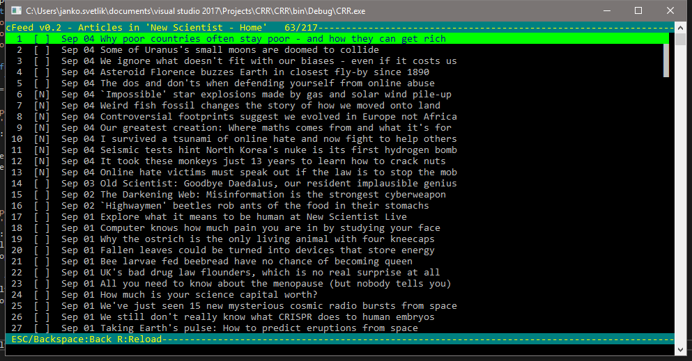

# Console Feed Reader
Readme file

## About
Cfeed (formerly CRR) is purely textual, console based RSS and Atom feed reader for Windows platform built in C#. It uses System.ServiceModel.Syndication namespace to read RSS 2.0 or Atom 1.0 feeds and HtmlAgilityPack to render textual article content.

This project was inspierd by wonderfull Newsbeuter and a lack of similar tool for Windows platform.

## Basic Usage
Before running cfeed for the first time, you have to do some basic configuration. The only required configuration consists of list of URL's of RSS or Atom feeds.
See [settings.conf](https://github.com/sveco/CRR/blob/master/CRR/settings.conf) for example configuration. You can remove everything except the **Feeds** section. The only required property in **Feeds** colleciton is **FeedUrl**. Minimal *settings.conf* looks like this:

```
{
    Feeds: [{FeedUrl: "http://feeds.newscientist.com/"}]
}
```

Any setting in embedded *default.conf* can be overridden in *settings.conf* placed in application root folder.

More about config in next section.

After setting feeds in config file, you can run the app. Application will list configured feeds, and refresh the feed contents in background.

By default, you can open the feed with **Spacebar** or **Enter** key. This will list articles in the feed. Hitting same kays again will open selected feed item. Use **Arrow Up**, **Arrow Down**, **Page Up** and **Page Down** keys to navigate lists. By default return to previous screen using **Backspace** or **Escape** (can be configured differently in settings).

Hitting **R** while on list of feeds will refresh selected feed, and **Control+R** will refresh all feeds."

When on article, article content will be loaded on background. Hitting **O** will open selected article in default (or configured) browser.




## Configuration

Cfeed uses json files to store app configuration. Embedded *default.conf* provides default settings when no other config file is present. User setting are stored in *settings.conf*. Any setting in latter file overrides default settings.
The *settings.conf* also includes list of feeds, but there are plans to move this to separate *feedlist.conf* file.

Structure of JSON object is

Feeds - list of feeds and feed related settings
UI - look & feel of application
Shortcuts - key bindings
App - app related settings, like external browser etc.

***Feeds***

Basic setting.conf can look like this:

```
{
    Feeds: [
    {
        #URL of RSS otr Atom feed
        FeedUrl: "http://feeds.newscientist.com/",
        #Define filters for html id's and classes. Elements from those classes will be ignored when converting html to text. use '.' prefix for classes and # for id's.
        Filters: ["#main-nav", "#breadcrumbs", ".masthead-container",".signpost", ".entry-meta", ".footer", "#mpu-sidebar", ".leaderboard-container", "#registration-barrier", ".entry-form g50"],
        #Custom title to override default feed title
        Title: "New Scientist - Home Custom",
        #Tags can be used to categorize feeds and articles. Thas can be used in query to filter on
        Tags: ["Science"],
        #If uncommented, feed will be hidden and only accessible via FeedQuery
        #Hidden: true,
        #If set to true, reloads feed automatically
        AutoReload: true,
        #If AutoReload is set to true, this defines number of seconds after which feed will be automatically reloaded
        ReloadInterval: 30
    }
}
```

Only FeedUrl is required, other settings are optional. Filers can be used to "filter" out unwanted content, like page navigation, links, registration forms etc.
To use filter, look source of the page that you want to display. Prepend all "class" attributes of html elements you want to filter out with ".", and all "id" attributes of html elements with "#".
Any content inside filtered elements will not be rendered.
Title can be used to display custom title of feed, instead of the one defined by feed itself.

***Dynamic Feeds***

Yay! It is now supported to filter articles in online feed by defining FeedQuery, or create dynamic feed by specifying FeedQuery without the FeedUrl. Latter will search all downloaded articles, and crete "virtual" feed from search results.

*Example: Dynamic feed*
```
{ 
    #Dynamic feed - find all articles with word 'Mars' in Title or Summary.
    FeedQuery: "(Summary.Contains(\"Mars\") || Title.Contains(\"Mars\"))",
    Title: "Dynamic feed - Mars"
}
```

*Example: Filtered feed*
```
{ 
    #Filtered feed - find all articles in newscientist feed with word 'Mars' in Title or Summary
    FeedUrl: "http://feeds.newscientist.com/",
    FeedQuery: "(Summary.Contains(\"Mars\") || Title.Contains(\"Mars\"))",
    Title: "Online feed - Mars"
}
```

**FeedQuery syntax**

FeedQuery string is interpreted using System.Linq.Dynamic.DynamicQueryable class. Supported entities to use in query are listed in following table:

Name            | Type          | Meaning
:-------------- | :------------ | :------------
FeedUrl         | String        | Url of parent rss feed
PublishDate     | String        | Article publish date/last updated date (whichever is latest)
Summary         | String        | Short article summary
Title           | Strong        | Article title
IsNew           | Boolean       | Read/Unread flag
Hidden          | Boolean       | Should feed be hidden in list
Index           | Integer       | Article Index


***UI***

UI section of config can be used to customize look and feel of application.

TODO: In the future, I plan to change how UI is configured, by providing layout template in for each displayed UI element.

***UI.Strings***

Formatting for various UI elements. Formatting string must start by % followed by specific identifier, dependant on type of element displayed. To define column width use following format:
"%i:3r" is replaced by Index, right aligned and padded to 3 characters width. To align string left, use "l", e.g. "%i:3l".

Following tables defines identifiers for each UI.String element

Setting | Meaning | Default value
:------------ | :------------- | :------------
ReadStateNew                | String to show when feed contains unread items, or article is new. | "N"
ReadStateRead               | String to show when all items in feed has been read, or article is not new. | " "
DownloadStateDownloaded     | String to show when article content is saved locally |  "D"
DownloadStatePending        | String to show when article content is not downloaded | " "
DeleteStateDeleted          | String to show when article has been marked for deletion | "X",
DeleteStateNotDeleted       | String to show when article has not been marked for deletion | " ",
LoadingSuffix               | Suffix shown when feed or article are being loaded | " - Loading..."
LoadingPrefix               | Prefix shown when feed or article are being loaded | ""
FeedListHeaderFormat        | Title shown in header when list of feeds is displayed | "╗ cfeed v%V - console feed reader ╔",
FeedListItemFormat          | Format of feed list items | "%i:3r %n [%u] %g:16l %t",
FeedListFooterFormat        | Format for feed list footer | " Q:Quit ENTER/Space:List articles R:Reload Ctrl+R:Reload all ",
ArticleListHeaderFormat     | Format of article list titlw | "╗ cFeed v%V - Articles in \'%t\' %u ╔",
ArticleListItemFormat       | Format of article list item | "%i:3r [%n\|%D\|%x] %d %t",
ArticleListDateFormat       | Date format for dates shown in article list | "MMM dd",
ArticleListFooterFormat     | Format for article list footer | " ESC/Backspace:Back M:Mark read U:Mark Unread R:Reload ",
ArticleTitleFormat          | Format of article title | "cFeed v%V - Article:%t ",
ArticleFooter               | Format for article footer | " ESC/Backspace:Back O:Open N:Next L:Link I:Image",
ArticleTextFeedUrlLabel     | Label for feed url in article header | "Feed: ",
ArticleTextTitleLabel       | Label for article title in article header | "Title: ",
ArticleTextAuthorsLabel     | Label for authors article header | "Author(s): ",
ArticleTextLinkLabel        | Label for article url in article header | "Link: ",
ArticleTextPublishDateLabel | Label for publish date in article header | "Date: ",
PromptMarkAll               | Prompt to confirm to mark all article in feed as read | "Mark all articles as read [Y/n]:",
PromptPurge                 | Propmt to confirm purging of articles marked for deletion | "Purge deleted articles? [Y/n]:",
PromptAnswerYes             | Enter this letter for prompt to return true | "Y"


Replacement strings for *ApplicationTitleFormat*:

String | Meaning
------------ | -------------
%V | Major.Minor version
%v | Full version, Major.Minor.Revision.Build

Replacement strings for *FeedListFormat* and *FeedTitleFormat*:

String | Meaning
------------ | -------------
%i | Feed index
%l | RSS/ATOM feed url
%n | Read state flag (New/Read)
%D | Download state flag (Downloaded/Pending)
%x | Deleted flag
%u | # of unread / total items
%T | # of total items
%U | # of unread items
%t | CustomTitle ?? Title ?? FeedUrl
%V | Major.Minor version
%v | Full version, Major.Minor.Revision.Build
%g | Feed tags

Replacement strings for *ArticleListFormat* and *ArticleTitleFormat*:

String | Meaning
------------ | -------------
%i | Feed index
%l | RSS/ATOM feed url
%n | Read state flag (New/Read)
%d | Article publish date / Last uppdated date (which one is latest)
%t | Article title
%s | Summary


***UI.Colors***

Colors section can be used to define custom color "theme" for the app. Colors for UI elements are defined in Layout section.
For a valid list of color names see this [list on MSDN](https://msdn.microsoft.com/en-us/library/system.consolecolor(v=vs.110).aspx).

Setting | Default value
:------------ | :-------------
ArticleHeaderBackground | "DarkCyan",
ArticleHeaderForeground | "Yellow",
ArticleFooterBackground | "DarkCyan",
ArticleFooterForeground | "Yellow",
ArticleTextHighlight    | "Yellow",
LinkHighlight           | "DarkCyan",
ImageLinkHighlight      | "Yellow",
LinkInputForeground     | "Black",
LinkInputBackground     | "DarkYellow"

***UI.Layout***

Defines general layout of the application. Layout must containg following items:

Element         | Description
:------------   | :-------------
FeedList        | Defines layout of Feed List view 
ArticleList     | Defines layout of Article List view 
Article         | Defines layout of Article view 

Each elemant can contain Width, Height, and list of controls that will be generated for view. See [default.conf](https://github.com/sveco/CRR/blob/master/CRR/default.conf) for example.

***Shortcuts***

Defines keyboard keys and modifiers combination that trigger particular action. For a valid list of **[keys see this link](https://msdn.microsoft.com/en-us/library/system.consolekey(v=vs.110).aspx)**.
For a valid list of **[modifiers see here](https://msdn.microsoft.com/en-us/library/system.consolemodifiers(v=vs.110).aspx)**.
Some key combinations are used by windows itself if you enable advanced console features. **[Avoid those combinations](https://technet.microsoft.com/en-us/library/mt427362.aspx)**.

Each Key and Modifiers object can be an array. If you define more than one Key, pressing any of the keys will trigger action. If you define more than one modifier, all modifiers have to be pressed. For example, definiton {Key: ["S,D"], Modifiers: ["Control", "Alt"] } means it will trigger on CTRL+ALT+S or CTRL+ALT+D.

Setting | Key | Action | Scope
:------------ | :------------- | :------------- | :-------------
QuitApp     |   { Key: ["Q"] }                        | Exits the app                     | Feed list
Reload      |   { Key: ["R"] }                        | Reloads selected feed or article  | Feed list, Article list
ReloadAll   |   { Key: ["R"], Modifiers: ["Control"]} | Reolad all feeds                  | Feed list
OpenArticle |   { Key: ["Enter", "Spacebar"] }        | Opens selected article            | Article list
OpenBrowser |   { Key: ["O"] }                        | Opens article or feed in browser  | Feed list, Article list, Article
OpenFeed    |   { Key: ["Enter", "Spacebar"] }        | Lists articles in selected feed   | Feed list
RefreshView |   { Key: ["F"] }                        | Redraws the UI                    | Feed list
Prev        |   { Key: ["OemComma"] }                 | (<) Previous article              | Article
PrevUnread  |   { Key: ["Oem4"] }                     | ([) Previous unread article       | Article
Next        |   { Key: ["OemPeriod"] }                | (>) Next Article                  | Article
NextUnread  |   { Key: ["Oem6"] }                     | (]) Next unread article           | Article
Delete      |   { Key: ["X"] }                        | Mark selected article for deletion| Article
StepBack    |   { Key: ["Escape", "Backspace"]}       | Navigates back                    | Feed list, Article list, Article
SaveArticle |   { Key: ["S"] }                        | Reolads article from web and saves| Article
Download    |   { Key: ["D"] }                        | Downloads Article                 | Article list
MarkRead    |   { Key: ["M"] }                        | Mark selected article as read     | Article list
MarkAllRead |   { Key: ["A"]                          | Mark all articles as read		  | Feed List (selected item)
MarkUnread  |   { Key: ["U"] }                        | Remove read flag                  | Article list
OpenLink    |   { Key: ["L"] }                        | Open numbered link in browser     | Article
OpenImage   |   { Key: ["I"] }                        | Open numbered image in browser    | Article

Following keys are set by default on picklists and text area. They are not configurable, however they are fairly obvious.

Key     | Action   | Scope
:------ | :------- | :--------
Up      | Up one item          | Feed list, Article list
Down    | Down one item        | Feed list, Article list
PgUp    | Scroll up 10 items   | Feed list, Article list
PgDown  | Scroll down 10 items | Feed list, Article list

***Other settings***

Setting | Description | Default value
:------------ | :-------------------------------------------------------------------------- | -----------------------
SavedFileName | Format for file name of saved articles                                      | ".\\saved\\%d\\%t.txt"
Database      | Name of liteDB database used to store metadata                              | "cfeed.db" 
Opml          | Path to OPML file to load. Can be also set by command line param -o \<path> | \<empty> 
Refresh       | Refresh feeds on load                                                       | true
Browser       | Custom browser to use to open articles, links and images                    | \<empty\>
Debug         | Debug level to write to log. Levels are None, Debug, Info, Warning, Error, Critical, in that order. Setting level to "Warning", will log Warning, Error and Critical. SEtting none turns off logging. | "Warning"
ReloadInterval| Default reload interval for feeds set to auto update                        | 30


Replacement strings for *SavedFileName*. File name will be sanitized. Absolute, relative and network locations are supported, just make sure you have write access to defined location.

String | Meaning
------------ | -------------
%i | Feed index
%l | RSS/ATOM feed url
%n | Read state flag (New/Read)
%d | Article publish date
%t | Article title

## Command Line Arguments
```
cfeed [-h] [-d <database>] [-r <true|false>] [-o <opml uri/path>]

 -h  Show help.
 -d  Database; Override default db location.
 -r  Refresh; Whether to refresh all feeds on first load.
 -o  Import OPML feed list
```
OPML support is limited to reading list of feeds from opml file and displaying them. They are not exported or added to .conf file, this has to be done manually. However read state is tracked for articles in those feeds, and they can also be selected using dynamic query.

## Acknowledgments
Big thanks to awesome newsbeuter team for inspiration. This app is built from scratch, and does not use any portion
of newsbeuter code. This is open source project to provide windows users with purely textual Atom and RSS feed reader.

+ This app uses [JsonConfig](https://github.com/Dynalon/JsonConfig) to parse configuration files.
+ [HtmlAgilityPack](https://github.com/zzzprojects/html-agility-pack) is used to parse article content.
+ [LiteDb](https://github.com/mbdavid/LiteDB) is used for local storage of article metadata.

### Todos
+ Write unit tests
+ Add more features
+ Get some rest

### Contributing

1. Fork it!
2. Create your feature branch: git checkout -b my-new-feature
3. Commit your changes: git commit -am 'Add some feature'
4. Push to the branch: git push origin my-new-feature
5. Submit a pull request :D

License
----

MIT 
