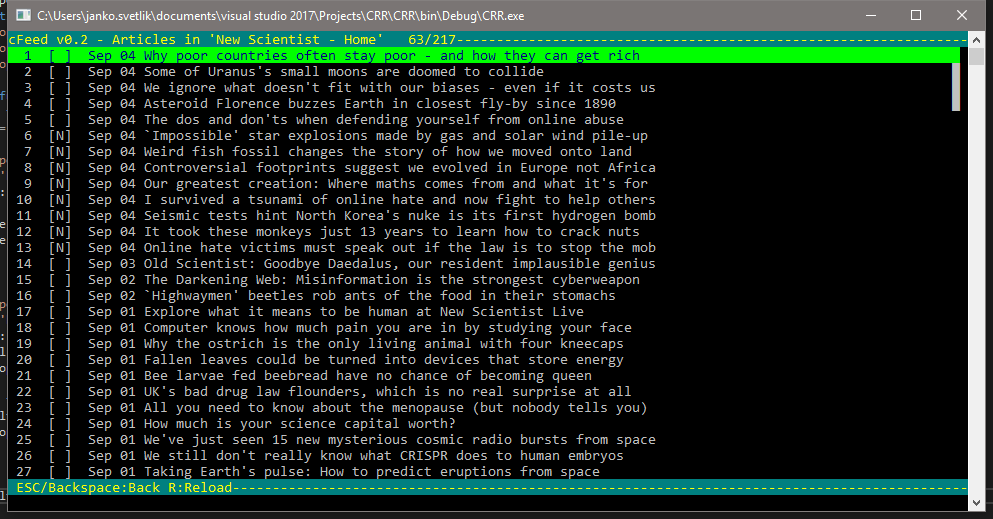

# cfeed – Console RSS/Atom Feed Reader

A purely textual, console based RSS and Atom feed reader for Windows, written in C#.

**[Download the latest version](https://github.com/sveco/cfeed/releases/latest)**



## About

cfeed (formerly CRR) reads RSS 1.0, RSS 2.0 and Atom 1.0 feeds using `System.ServiceModel.Syndication`, and renders article HTML as text with [HtmlAgilityPack](http://html-agility-pack.net).

It was inspired by the wonderful [Newsbeuter](https://newsbeuter.org) and the lack of a similar tool for Windows. It is built from scratch and does not use any newsbeuter code.

## Quick Start

1. Create `settings.conf` in the application folder. The only required setting is a list of feeds, and the only required property of a feed is `FeedUrl`:

   ```
   {
       Feeds: [{FeedUrl: "http://feeds.newscientist.com/"}]
   }
   ```

   See [settings.conf](https://github.com/sveco/cfeed/blob/master/CRR/settings.conf) for a fuller example.
2. Run `cfeed`. It lists your feeds and refreshes them in the background.
3. Read:

| Key                          | Action                                                      |
| :--------------------------- | :---------------------------------------------------------- |
| **Enter** / **Spacebar**     | Open the selected feed, then the selected article           |
| **Up / Down / PgUp / PgDn**  | Move through lists                                          |
| **Backspace** / **Escape**   | Go back                                                     |
| **R** / **Ctrl+R**           | Refresh the selected feed / all feeds (feed list)           |
| **O**                        | Open the article in the browser (article content loads in the background) |

All keys can be changed, see [Shortcuts](#shortcuts).

## Configuration

Configuration is stored in JSON files:

- An embedded *default.conf* provides the defaults ([view it here](https://github.com/sveco/cfeed/blob/master/CRR/default.conf)).
- *settings.conf* in the application folder overrides any of those settings. It also holds your list of feeds (a separate *feedlist.conf* is planned).

Top-level sections:

| Section     | Purpose                                                          |
| :---------- | :--------------------------------------------------------------- |
| `Feeds`     | Feeds and per-feed settings (URL, filters, custom title, ...)    |
| `UI`        | Look and feel, layout of the views                               |
| `Shortcuts` | Key bindings                                                     |
| App-level   | Browser, database, logging etc. (see [Other settings](#other-settings)) |

### Feeds

A feed with all options (only `FeedUrl` is required; `#` starts a comment):

```
{
    Feeds: [
    {
        #URL of the RSS or Atom feed
        FeedUrl: "http://feeds.newscientist.com/",
        #XPath selector for the single node used as the root of the article. Filters are applied after Select.
        Select: "//html",
        #Elements to ignore when converting HTML to text. Prefix classes with '.', ids with '#'.
        #A filter starting with '/' is an XPath expression, e.g. "//*[@data-block='promoList']".
        Filters: ["#main-nav", ".masthead-container", ".signpost", ".entry-meta", ".footer"],
        #Show links as plain text, without link markers and numbers. Default: false.
        #StripLinks: true,
        #Custom title that overrides the title of the feed
        Title: "New Scientist - Home Custom",
        #Tags to categorize feeds and articles. Can be used in queries.
        Tags: ["Science"],
        #Hide the feed from the list; it is then only reachable through a FeedQuery
        #Hidden: true,
        #Build article text from the content in the feed instead of downloading the page. Default: false.
        #UseFeedContent: true,
        #Reload this feed automatically
        AutoReload: true,
        #Seconds between automatic reloads. Default: 30.
        ReloadInterval: 30
    }]
}
```

| Property         | Purpose                                                              |
| :--------------- | :------------------------------------------------------------------- |
| `FeedUrl`        | **Required** (unless using a dynamic feed). URL of the feed.         |
| `Title`          | Display title instead of the one the feed defines.                   |
| `Select`         | XPath of the node to use as article root.                            |
| `Filters`        | Elements to leave out of the article.                                |
| `StripLinks`     | Show link text without markers.                                      |
| `UseFeedContent` | Use the content published in the feed itself.                        |
| `Tags`           | Categories, usable in queries and shown with `%g`.                   |
| `Hidden`         | Hide from the feed list.                                             |
| `UserName`, `Password` | Credentials for feeds that need authentication.                |
| `AutoReload`, `ReloadInterval` | Automatic refresh and its interval in seconds.         |
| `FeedQuery`      | Filter articles, or build a dynamic feed (see below).                |

#### Select and Filters

Web pages contain navigation, ads and other clutter. To get just the article:

1. **Select** the node that holds the article. This makes the filter list much shorter. Select works on its own; Filters are optional.
2. **Filter** out what is left over. View the page source, then use `.` before an element's `class` and `#` before its `id`. Anything inside a filtered element is not rendered.

*Example: Slashdot*
```
{
    FeedUrl: "http://rss.slashdot.org/slashdot/slashdot",
    Select: "//div[@id='firehoselist']",
    Filters: [".view_mode", "#newa2footerv2"]
}
```

**XPath filters.** Some sites generate class names (for example *ssrcss-15twdc6-Stack*) that change without notice, or put the same class on content and on clutter. A filter that starts with `/` is treated as an XPath expression instead of a class or id. Every matching element is left out together with its content. Both kinds can be mixed in one list. An invalid expression is ignored (and logged); the other filters still apply.

```
Filters: [".share-tools", "#footer", "//*[@data-block='promoList']", "//div[contains(@class,'advert')]"]
```

*Example: BBC News.* BBC article pages keep the story in `<main id="main-content">` and mark each block with a `data-block` attribute. This shows the story with author and time, and leaves out menus, photos, video players and related links:
```
{
    FeedUrl: "http://feeds.bbci.co.uk/news/world/rss.xml",
    Title: "BBC News - World",
    Select: "//main[@id='main-content']",
    StripLinks: true,
    Filters: ["//*[@data-block='headline']", "//*[@data-block='image']", "//*[@data-block='media']",
              "//*[@data-block='topicList']", "//*[@data-block='promoList']"]
}
```
Video pages have no article, so they show little text. Add `"//*[@data-block='byline']"` to also leave out the author line.

#### StripLinks

By default a link is shown as *[Link:text][3]* and can be opened with **L**. With `StripLinks: true` only the link text is shown, and those links are not available with **L**. Images are not affected; use a filter to leave them out.

#### UseFeedContent

By default, opening an article downloads its web page and converts it to text. Some sites, like reddit, serve pages built by JavaScript, which come out empty. Set `UseFeedContent: true` to build the article from the content the feed itself publishes (for example the content element of an Atom entry). Links in that content are numbered as usual and open with **L**.

For a reddit link post, the content has the *[link]* and *[comments]* links, so **L** opens the linked article, while **O** opens the reddit comments page.

```
{
    FeedUrl: "https://www.reddit.com/r/news/.rss",
    UseFeedContent: true,
    Title: "Reddit News"
}
```

Notes:
- If an entry has no content, the article page is downloaded as usual.
- `Select` and `Filters` apply to feed content the same way as to a downloaded page.
- The content is read when the feed is refreshed. After enabling the option, refresh the feed (**R** in the feed list) so existing articles get their content.
- Articles already saved locally are shown from the saved copy. Delete the saved copy (**Delete** in the article list) to build it again.

#### Dynamic and filtered feeds

`FeedQuery` filters the articles of an online feed. Without a `FeedUrl` it searches all downloaded articles and builds a "virtual" feed from the results.

```
{
    #Dynamic feed: all downloaded articles with 'Mars' in Title or Summary
    FeedQuery: "(Summary.Contains(\"Mars\") || Title.Contains(\"Mars\"))",
    Title: "Dynamic feed - Mars"
},
{
    #Filtered feed: only articles from this feed with 'Mars' in Title or Summary
    FeedUrl: "http://feeds.newscientist.com/",
    FeedQuery: "(Summary.Contains(\"Mars\") || Title.Contains(\"Mars\"))",
    Title: "Online feed - Mars"
}
```

The query is interpreted by `System.Linq.Dynamic.DynamicQueryable`. Fields available in a query:

| Name        | Type    | Meaning                                                      |
| :---------- | :------ | :----------------------------------------------------------- |
| FeedUrl     | String  | URL of the parent feed                                       |
| PublishDate | String  | Publish or last updated date (whichever is latest)           |
| Summary     | String  | Short article summary                                        |
| Title       | String  | Article title                                                |
| IsNew       | Boolean | Read/unread flag                                             |
| Hidden      | Boolean | Whether the feed is hidden in the list                       |
| Index       | Integer | Article index                                                |

### UI

The `UI` section controls the look and feel. (Planned: a layout template per displayed element.)

#### UI.Strings

Text and format of UI elements. A format string uses `%` followed by an identifier (tables below). To set a column width add `:width` and an alignment: `"%i:3r"` is the index, right aligned, padded to 3 characters; `"%i:3l"` aligns left.

| Setting                     | Meaning                                              | Default |
| :-------------------------- | :--------------------------------------------------- | :------ |
| ReadStateNew                | Feed has unread items / article is new               | `"N"` |
| ReadStateRead               | All items read / article is not new                  | `" "` |
| DownloadStateDownloaded     | Article content is saved locally                     | `"D"` |
| DownloadStatePending        | Article content is not downloaded                    | `" "` |
| DeleteStateDeleted          | Article is marked for deletion                       | `"X"` |
| DeleteStateNotDeleted       | Article is not marked for deletion                   | `" "` |
| LoadingSuffix               | Shown after a feed or article being loaded           | `" - Loading..."` |
| LoadingPrefix               | Shown before a feed or article being loaded          | `""` |
| FeedListHeaderFormat        | Header of the feed list                              | `"╗ cfeed v%V - console feed reader ╔"` |
| FeedListItemFormat          | Feed list item                                       | `"%i:3r %n [%u] %g:16l %t"` |
| FeedListFooterFormat        | Footer of the feed list                              | `" Q:Quit ENTER/Space:List articles R:Reload Ctrl+R:Reload all "` |
| ArticleListHeaderFormat     | Header of the article list (uses the *feed list* identifiers) | `"╗ cFeed v%V - Articles in '%t' (%U unread, %T total) ╔"` |
| ArticleListItemFormat       | Article list item                                    | `"%i:3r [%n\|%D\|%x] %d  %t"` |
| ArticleListDateFormat       | Date format in the article list                      | `"MMM dd"` |
| ArticleListFooterFormat     | Footer of the article list                           | `" ESC/Backspace:Back M:Mark read U:Mark Unread R:Reload "` |
| ArticleHeaderFormat         | Header of the article view                           | `" cFeed v%V - Article:%t - Last update: %u "` |
| ArticleFooterFormat         | Footer of the article view                           | `" ESC/Backspace:Back O:Open N:Next L:Link I:Image S:Download <:Prev >:Next [:Prev Unread ]:Next Unread "` |
| LoadingText                 | Shown in the article view while content loads        | `" loading content "` |
| ArticleTextFeedUrlLabel     | Feed URL label in the article header                 | `"Feed: "` |
| ArticleTextTitleLabel       | Title label in the article header                    | `"Title: "` |
| ArticleTextAuthorsLabel     | Authors label in the article header                  | `"Author(s): "` |
| ArticleTextLinkLabel        | Article URL label in the article header              | `"Link(s): "` |
| ArticleTextPublishDateLabel | Publish date label in the article header             | `"Date: "` |
| PromptMarkAll               | Confirm marking all articles in a feed as read       | `"Mark all articles as read?"` |
| PromptDeleteAll             | Confirm marking all articles in a feed for deletion  | `"Mark all articles for deletion?"` |
| PromptPurge                 | Confirm purging articles marked for deletion         | `"Purge deleted articles?"` |
| PromptAnswerYes             | Text of the "Yes" option                             | `"Yes"` |
| PromptAnswerNo              | Text of the "No" option                              | `"No"` |

Which identifiers apply depends on the format. `%V` and `%v` work in every format.

| String | Meaning                                        |
| :----- | :--------------------------------------------- |
| %V     | Major.Minor version                            |
| %v     | Full version, Major.Minor.Revision.Build       |

**Identifiers for feed formats** (`FeedList*` and `ArticleListHeaderFormat`/`ArticleListFooterFormat`):

| String | Meaning                              |
| :----- | :----------------------------------- |
| %i     | Feed index (starts at 1)             |
| %l     | Feed URL                             |
| %n     | Read state flag (New/Read)           |
| %u     | Unread / total items                 |
| %T     | Total items                          |
| %U     | Unread items                         |
| %t     | CustomTitle ?? Title ?? FeedUrl      |
| %g     | Feed tags                            |

**Identifiers for article formats** (`ArticleListItemFormat`, `ArticleHeaderFormat`):

| String | Meaning                                                 |
| :----- | :------------------------------------------------------ |
| %i     | Article index (starts at 1)                             |
| %n     | Read state flag (New/Read)                              |
| %D     | Download state flag (Downloaded/Pending)                |
| %x     | Deleted flag                                            |
| %d     | Publish or last updated date (whichever is latest)      |
| %u     | Last updated date                                       |
| %t     | Article title                                           |
| %s     | Summary                                                 |
| %l     | Feed URL                                                |

#### UI.Colors

Defines colors used inside article text. Header, footer and list colors are set per control in the layout (`ForegroundColor`, `BackgroundColor`). Valid names are listed in [ConsoleColor](https://msdn.microsoft.com/en-us/library/system.consolecolor(v=vs.110).aspx).

| Setting                | Default        |
| :--------------------- | :------------- |
| ArticleTextHighlight   | `"Yellow"`     |
| LinkHighlight          | `"DarkCyan"`   |
| LinkTextHighlight      | `"White"`      |
| ImageLinkHighlight     | `"Yellow"`     |
| ImageLinkTextHighlight | `"Yellow"`     |
| LinkInputForeground    | `"Black"`      |
| LinkInputBackground    | `"DarkYellow"` |

#### UI.Layout

Defines the layout of the three views:

| Element     | Description                |
| :---------- | :------------------------- |
| FeedList    | Layout of the feed list    |
| ArticleList | Layout of the article list |
| Article     | Layout of the article view |

Each element has a `Width`, a `Height` and a list of controls generated for the view. See [default.conf](https://github.com/sveco/cfeed/blob/master/CRR/default.conf) for an example.

- The `Width` and `Height` of the first view (FeedList) set the console window size at startup. They are not applied again when other views open, so a window you resized stays as it is.
- A control's `Width` or `Height` can be negative, meaning the console size minus that number (`Width: -3` is the console width minus 3). Such controls follow the console when it is resized.

**Resizing the console.** You can resize the window at any time. cfeed waits until the new size has settled, then redraws the current view: header, footer, lists, and article text (re-wrapped to the new width). The selected item and scroll position stay visible. Header and footer text longer than the window is shortened. Controls with a fixed `Top` or `Height` (for example `Top: 20` of the Loading text in the Article layout) stay where they are.

### Shortcuts

Each shortcut binds a key (and optional modifiers) to an action.

- Valid [key names](https://msdn.microsoft.com/en-us/library/system.consolekey(v=vs.110).aspx) and [modifier names](https://msdn.microsoft.com/en-us/library/system.consolemodifiers(v=vs.110).aspx) come from the .NET `ConsoleKey` and `ConsoleModifiers` enums.
- `Key` and `Modifiers` can be arrays. With several keys, **any** of them triggers the action. With several modifiers, **all** must be held. `{Key: ["S", "D"], Modifiers: ["Control", "Alt"]}` triggers on Ctrl+Alt+S or Ctrl+Alt+D.
- Windows reserves some key combinations when advanced console features are enabled. [Avoid those](https://technet.microsoft.com/en-us/library/mt427362.aspx).

| Setting     | Default binding                                   | Action                                | Scope |
| :---------- | :------------------------------------------------ | :------------------------------------ | :---- |
| QuitApp     | `{Key: ["Q"]}`                                    | Exit the app                          | Feed list |
| Reload      | `{Key: ["R"]}`                                    | Reload selected feed or article       | Feed list, Article list |
| ReloadAll   | `{Key: ["R"], Modifiers: ["Control"]}`            | Reload all feeds                      | Feed list |
| OpenFeed    | `{Key: ["Enter", "Spacebar"]}`                    | List articles in selected feed        | Feed list |
| OpenArticle | `{Key: ["Enter", "Spacebar"]}`                    | Open selected article                 | Article list |
| OpenBrowser | `{Key: ["O"]}`                                    | Open article or feed in browser       | Feed list, Article list, Article |
| RefreshView | `{Key: ["F"]}`                                    | Redraw the UI                         | Feed list |
| Prev        | `{Key: ["OemComma"]}`                             | `<` Previous article                  | Article |
| PrevUnread  | `{Key: ["Oem4"]}`                                 | `[` Previous unread article           | Article |
| Next        | `{Key: ["OemPeriod"]}`                            | `>` Next article                      | Article |
| NextUnread  | `{Key: ["Oem6"]}`                                 | `]` Next unread article               | Article |
| Delete      | `{Key: ["X"]}`                                    | Mark selected article for deletion    | Article list, Article |
| DeleteContent | `{Key: ["Delete"]}`                             | Delete locally saved article content  | Article list |
| DeleteAll   | `{Key: ["X"], Modifiers: ["Control", "Alt"]}`     | Mark all articles for deletion        | Article list |
| Purge       | `{Key: ["D4"], Modifiers: ["Shift"]}`             | Purge deleted articles                | Feed list |
| StepBack    | `{Key: ["Escape", "Backspace"]}`                  | Navigate back                         | Feed list, Article list, Article |
| SaveArticle | `{Key: ["S"]}`                                    | Reload article from the web and save  | Article |
| Download    | `{Key: ["D"]}`                                    | Download article                      | Article list |
| MarkRead    | `{Key: ["M"]}`                                    | Mark selected article as read         | Article list |
| MarkAllRead | `{Key: ["A"]}`                                    | Mark all articles as read             | Article list, Feed list (selected item) |
| MarkUnread  | `{Key: ["U"]}`                                    | Remove read flag                      | Article list |
| OpenLink    | `{Key: ["L"]}`                                    | Open numbered link in browser         | Article |
| OpenImage   | `{Key: ["I"]}`                                    | Open numbered image in browser        | Article |
| Search      | `{Key: ["Oem2"]}`                                 | `/` Search feeds (title, description) | Feed list, Article list |

Navigation keys in lists are fixed and not configurable:

| Key    | Action               | Scope |
| :----- | :------------------- | :---- |
| Up     | Up one item          | Feed list, Article list |
| Down   | Down one item        | Feed list, Article list |
| PgUp   | Scroll up 10 items   | Feed list, Article list |
| PgDown | Scroll down 10 items | Feed list, Article list |

### Other settings

| Setting        | Description                                                          | Default |
| :------------- | :------------------------------------------------------------------- | :------ |
| SavedFileName  | File name format for saved articles                                  | `".\\saved\\%d\\%t.txt"` |
| Database       | Name of the LiteDB database that stores metadata                     | `"cfeed.db"` |
| Opml           | Path to an OPML file to load (or use `-o` on the command line)       | empty |
| Refresh        | Refresh feeds on load                                                | `true` |
| Browser        | Full path of a browser executable to open links with. Used only if the file exists, otherwise the system default browser opens. Only http and https links are opened. | empty |
| Debug          | NLog log level: Trace, Debug, Info, Warn, Error, Fatal, Off. A level logs itself and everything more severe ("Warn" logs Warn, Error, Fatal). Off turns logging off. | `"Warn"` |

`SavedFileName` supports the following replacements. The file name is sanitized. Absolute, relative and network locations work, as long as you have write access.

| String | Meaning                    |
| :----- | :------------------------- |
| %i     | Feed index                 |
| %l     | Feed URL                   |
| %n     | Read state flag (New/Read) |
| %d     | Article publish date       |
| %t     | Article title              |

## Command Line Arguments

```
cfeed [-h] [-d <database>] [-r <true|false>] [-o <opml uri/path>]

 -h  Show help and exit.
 -d  Database; override the default db location.
 -r  Refresh; whether to refresh all feeds on first load.
 -o  Import an OPML feed list.
```

OPML support is limited: the list of feeds is read from the file and displayed, but not exported or added to a `.conf` file (do that manually). Read state is still tracked for articles in those feeds, and they can be used in dynamic queries.

## Acknowledgments

- [JsonConfig](https://github.com/Dynalon/JsonConfig) parses the configuration files.
- [HtmlAgilityPack](https://github.com/zzzprojects/html-agility-pack) parses article content.
- [LiteDB](https://github.com/mbdavid/LiteDB) stores article metadata locally.

## Contributing

1. Fork it
2. Create your feature branch: `git checkout -b my-new-feature`
3. Commit your changes: `git commit -am 'Add some feature'`
4. Push to the branch: `git push origin my-new-feature`
5. Submit a pull request

## License

MIT
